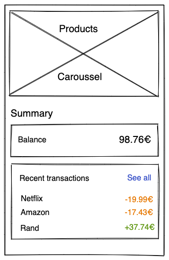

## App dashboard - Junior Frontend (React Native) Conding Challenge

### Context
Our users want to have some more information on their dashboard, and many of them asked us to add their balance and list of transactions.
This app needs to display the list of transactions and the total balance of the account.

### Product requirements

As a user:

- [ ] I want to see my account balance
- [ ] I want to see the list of transactions in the main page (last 5)
- [ ] I want to see the full list of transactions when I press on `See all`
- [ ] I want to see a negative transactions every 3 items

Create the React application that satisfies all must-have requirements above, plus any nice-to-have requirements you wish to include.

For that, you’ll need to make requests to:
* https://628b46b07886bbbb37b46173.mockapi.io/api/v1/products
* https://628b46b07886bbbb37b46173.mockapi.io/api/v1/transactions

For the layout of each page, please refer to the provided wireframes:

| Dashboard | Transactions |
| -------------|:-------------:|
|  |  |

### Instructions
* Fork this repo
* The challenge is on!
* Build a performant, clean and well-structured solution
* Commit early and often. We want to be able to check your progress
* Make the app public.
* Create a pull request
